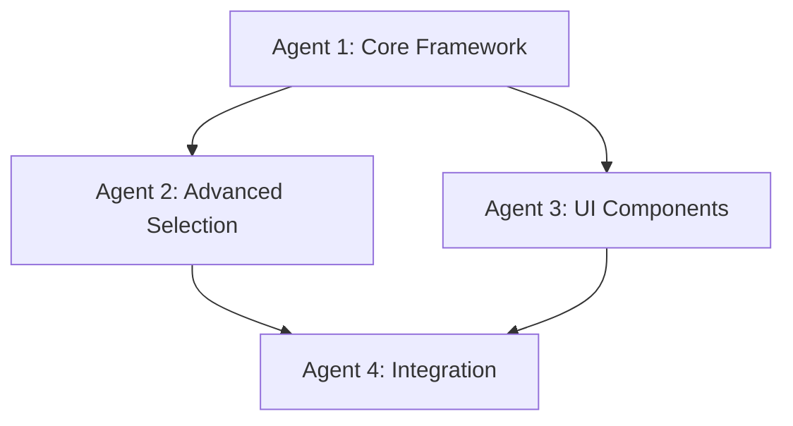

# Issue #26: Manual Validation Area Selection Tools - Complete Multi-Agent Implementation

## 🎯 **Issue Overview**
**[Manual Validation] Area Selection Tools for Document Processing Pipeline**

Create a comprehensive manual validation system with area selection capabilities, state management, UI components, and integration framework for the TORE Matrix Labs document processing pipeline.

---

## 🏗️ **Multi-Agent Implementation Structure**

### **Agent 1: Core Validation Framework & State Management**
**Sub-Issue: #26.1 - Core Validation Framework**
- **Branch**: `feature/validation-core-agent1-issue26-1`
- **Focus**: Foundation layer with state management and drawing infrastructure
- **Duration**: 4 days

**Key Deliverables:**
1. **Drawing State Management** (`drawing_state.py`)
   - DrawingStateManager with PyQt6 signals
   - State machine (IDLE, SELECTING, SELECTED, etc.)
   - DrawingArea and DrawingSession models
   
2. **Core Area Selection** (`area_select.py`)
   - ValidationAreaSelector base implementation
   - Selection modes and constraints
   - Basic rectangle/polygon selection foundation

3. **Shape Infrastructure** (`shapes.py`)
   - Base SelectionShape classes
   - RectangleShape and PolygonShape basics
   - Selection tool framework

4. **Integration Hooks**
   - PyQt6 signal framework for Agent 2-4 integration
   - Event system preparation
   - API foundation for advanced features

---

### **Agent 2: Advanced Area Selection & Snapping**
**Sub-Issue: #26.2 - Advanced Area Selection Tools**
- **Branch**: `feature/validation-selection-agent2-issue26-2`
- **Focus**: Enhanced selection tools with snapping and magnetic features
- **Duration**: 4 days
- **Depends**: Agent 1 completion

**Key Deliverables:**
1. **Advanced Snapping System** (`snapping.py`)
   - SnapEngine with magnetic field detection
   - EdgeDetector for document element boundaries
   - Multiple snap types (grid, element, custom)

2. **Enhanced Shape Tools**
   - FreehandShape with smoothing algorithms
   - Polygon tools with magnetic vertex snapping
   - Shape manipulation and editing

3. **Selection Algorithms**
   - Smart boundary detection
   - Content-aware selection suggestions
   - Multi-area selection support

4. **Performance Optimization**
   - Spatial indexing for large documents
   - Efficient collision detection
   - Responsive real-time feedback

---

### **Agent 3: UI Components & User Experience**
**Sub-Issue: #26.3 - UI Components & User Experience**
- **Branch**: `feature/validation-ui-agent3-issue26-3`
- **Focus**: Professional UI components and user experience
- **Duration**: 4 days
- **Depends**: Agent 1-2 completion

**Key Deliverables:**
1. **Validation Wizard** (`wizard.py`)
   - Multi-step validation workflow
   - Area Selection → OCR → Text Review → Element Type → Final Review
   - Progress tracking and state persistence

2. **Validation Toolbar** (`toolbar.py`)
   - Contextual tool selection
   - Drawing mode controls
   - Status indicators and progress feedback

3. **OCR Dialog** (`ocr_dialog.py`)
   - Advanced OCR visualization
   - Confidence highlighting
   - Text editing and correction tools

4. **UI Component Integration**
   - Merge/Split dialogs
   - Element preview components
   - Validation warnings and feedback

---

### **Agent 4: Integration & Production Readiness**
**Sub-Issue: #26.4 - Integration & Production Readiness**
- **Branch**: `feature/validation-integration-agent4-issue26-4`
- **Focus**: Complete system integration and production deployment
- **Duration**: 4 days
- **Depends**: Agent 1-3 completion

**Key Deliverables:**
1. **Integration Layer** (`integration.py`)
   - ValidationToolsIntegration unified interface
   - Cross-component communication
   - Session management and statistics

2. **Comprehensive Testing**
   - Unit tests for all components (>95% coverage)
   - Integration tests for complete workflows
   - Performance testing and optimization

3. **Documentation & Examples**
   - API documentation
   - Usage examples and tutorials
   - Integration guides

4. **Production Features**
   - Error handling and recovery
   - Logging and monitoring
   - Configuration management

---

## 📋 **Sub-Issue Breakdown**

### **Sub-Issue #26.1: Core Validation Framework**
```
Title: [Agent 1] Core Validation Framework & State Management
Labels: agent-1, validation, core, foundation
Assignee: Agent 1
Branch: feature/validation-core-agent1-issue26-1

Description:
Implement the foundational validation framework with state management, 
basic area selection, and integration hooks for advanced features.

Acceptance Criteria:
- [ ] DrawingStateManager with complete state machine
- [ ] Basic area selection with rectangle/polygon support
- [ ] Selection shape infrastructure
- [ ] Integration hooks for Agents 2-4
- [ ] Comprehensive unit tests (>95% coverage)
- [ ] Performance benchmarks established
```

### **Sub-Issue #26.2: Advanced Area Selection Tools**
```
Title: [Agent 2] Advanced Area Selection & Snapping Systems
Labels: agent-2, validation, selection, snapping
Assignee: Agent 2
Branch: feature/validation-selection-agent2-issue26-2

Description:
Build advanced selection tools with snapping algorithms, magnetic edge detection,
and enhanced shape manipulation capabilities.

Acceptance Criteria:
- [ ] SnapEngine with magnetic field detection
- [ ] Advanced shape tools (freehand, polygon editing)
- [ ] Performance-optimized selection algorithms
- [ ] Multi-area selection support
- [ ] Integration with Agent 1 foundation
- [ ] Comprehensive testing and benchmarks
```

### **Sub-Issue #26.3: UI Components & User Experience**
```
Title: [Agent 3] UI Components & User Experience Implementation
Labels: agent-3, validation, ui, ux
Assignee: Agent 3
Branch: feature/validation-ui-agent3-issue26-3

Description:
Create professional UI components including validation wizard, toolbar,
OCR dialog, and complete user experience workflows.

Acceptance Criteria:
- [ ] ValidationWizard with 6-step workflow
- [ ] ValidationToolbar with contextual controls
- [ ] OCRDialog with confidence highlighting
- [ ] UI component integration framework
- [ ] Professional styling and responsive design
- [ ] Accessibility compliance
```

### **Sub-Issue #26.4: Integration & Production Readiness**
```
Title: [Agent 4] Integration & Production Readiness
Labels: agent-4, validation, integration, production
Assignee: Agent 4
Branch: feature/validation-integration-agent4-issue26-4

Description:
Complete system integration, comprehensive testing, documentation,
and production readiness features.

Acceptance Criteria:
- [ ] Unified ValidationToolsIntegration interface
- [ ] Complete test suite (unit + integration)
- [ ] Production error handling and monitoring
- [ ] API documentation and examples
- [ ] Performance optimization and benchmarks
- [ ] Production deployment readiness
```

---

## 🚀 **Implementation Timeline**

### **Phase 1: Foundation (Days 1-4) - Agent 1**
- Core state management implementation
- Basic area selection framework
- Shape infrastructure and APIs
- Integration hooks preparation

### **Phase 2: Enhancement (Days 5-8) - Agent 2**
- Advanced snapping algorithms
- Enhanced selection tools
- Performance optimization
- Multi-area selection support

### **Phase 3: User Experience (Days 9-12) - Agent 3**
- UI component development
- Validation wizard implementation
- Professional styling and UX
- Component integration framework

### **Phase 4: Integration (Days 13-16) - Agent 4**
- Complete system integration
- Comprehensive testing suite
- Documentation and examples
- Production readiness features

---

## 🔗 **Agent Coordination Dependencies**



**Integration Points:**
- **Agent 1 → Agent 2**: State management APIs and selection framework
- **Agent 1 → Agent 3**: Drawing state signals and area selection events
- **Agent 2 → Agent 4**: Advanced selection algorithms and snapping APIs
- **Agent 3 → Agent 4**: UI components and user experience workflows

---

## 📊 **Success Metrics**

### **Technical Quality**
- **Test Coverage**: >95% across all components
- **Performance**: <100ms selection response time
- **Memory**: <50MB peak usage for 1000+ elements
- **Compatibility**: PyQt6 6.6+ support

### **User Experience**
- **Workflow Completion**: <5 minutes per validation
- **Error Rate**: <2% user errors in selection
- **Learning Curve**: <30 minutes for new users
- **Accessibility**: WCAG 2.1 AA compliance

### **Integration Quality**
- **API Stability**: Backward compatible interfaces
- **Documentation**: 100% API coverage
- **Examples**: Working code samples for all features
- **Error Handling**: Graceful degradation and recovery

---

## 🎯 **Agent Deployment Commands**

### **Agent 1 Deployment**
```bash
# Create Agent 1 branch and deploy
git checkout -b feature/validation-core-agent1-issue26-1
# Deploy using: "I need you to work on Sub-Issue #26.1 - Core Validation Framework..."
```

### **Agent 2 Deployment**
```bash
# After Agent 1 completion
git checkout -b feature/validation-selection-agent2-issue26-2
# Deploy using: "I need you to work on Sub-Issue #26.2 - Advanced Area Selection Tools..."
```

### **Agent 3 Deployment**
```bash
# After Agent 1-2 completion
git checkout -b feature/validation-ui-agent3-issue26-3
# Deploy using: "I need you to work on Sub-Issue #26.3 - UI Components & User Experience..."
```

### **Agent 4 Deployment**
```bash
# After Agent 1-3 completion
git checkout -b feature/validation-integration-agent4-issue26-4
# Deploy using: "I need you to work on Sub-Issue #26.4 - Integration & Production Readiness..."
```

---

## ✅ **Quality Assurance Requirements**

### **Code Quality**
- Full type hints throughout
- Comprehensive docstrings
- Clean architecture principles
- Performance optimization

### **Testing Requirements**
- Unit tests for all classes
- Integration tests for workflows
- Performance benchmarks
- Error condition coverage

### **Documentation Standards**
- API reference documentation
- User guides and tutorials
- Code examples and demos
- Architecture decision records

---

**Issue #26 Ready for Multi-Agent Deployment** 🚀

This comprehensive breakdown ensures each agent has clear scope, dependencies, and success criteria for implementing the complete Manual Validation Area Selection Tools system.