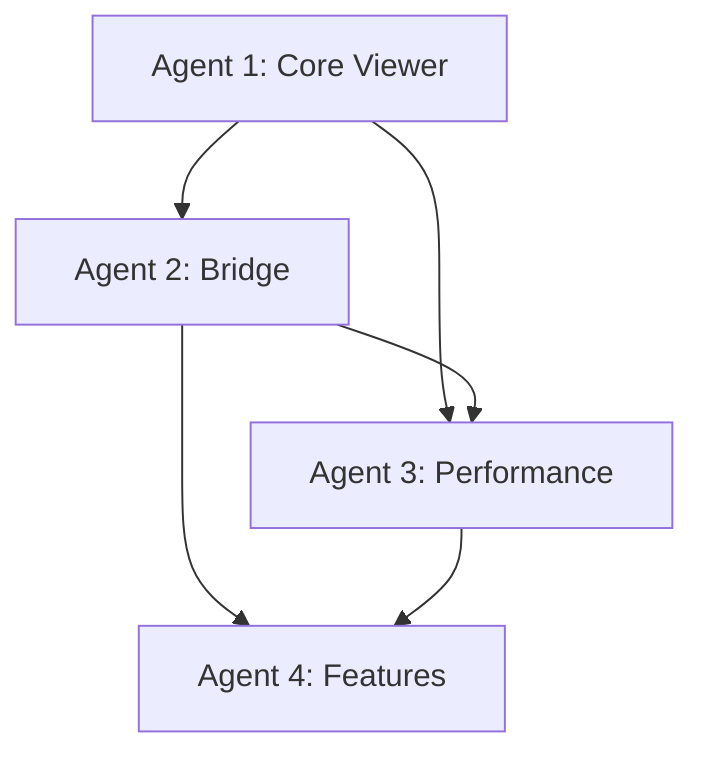

# PDF.js Integration Coordination Guide

## 🎯 Project Overview
**Goal**: Complete PDF.js integration for TORE Matrix Labs V3 document viewer with full feature set and optimal performance.

**Parent Issue**: #16 - [Document Viewer] PDF.js Integration  
**Timeline**: 6-day coordinated development cycle  
**Target**: Production-ready PDF.js viewer with advanced features

## 🚀 Agent Assignments & Timeline

### Agent 1: Core Viewer Foundation
- **Issue**: #124 - PDF.js Core Viewer Foundation
- **Timeline**: Day 1-2 (Critical Path)
- **Branch**: `feature/pdfjs-core-viewer`
- **Lead**: Foundation implementation that enables all other agents

### Agent 2: Qt-JavaScript Bridge
- **Issue**: #125 - PDF.js Qt-JavaScript Bridge  
- **Timeline**: Day 2-3 (Dependent on Agent 1)
- **Branch**: `feature/pdfjs-bridge`
- **Lead**: Communication layer enabling advanced features

### Agent 3: Performance Optimization  
- **Issue**: #126 - PDF.js Performance Optimization
- **Timeline**: Day 3-4 (Parallel with Agent 4)
- **Branch**: `feature/pdfjs-performance`
- **Lead**: Production performance and scalability

### Agent 4: Advanced Features & UI
- **Issue**: #127 - PDF.js Advanced Features Integration
- **Timeline**: Day 4-6 (Final integration)
- **Branch**: `feature/pdfjs-features`
- **Lead**: User-facing features and UI polish

## 📅 Daily Coordination Schedule

### Day 1: Foundation Setup
**Agent 1 Focus**: PDF.js bundle, core viewer, basic rendering
- Set up PDF.js resources and viewer.html
- Implement PDFViewer class with QWebEngineView
- Basic zoom and navigation controls
- **Deliverable**: Working PDF rendering in Qt

**Coordination Point**: End-of-day foundation review

### Day 2: Bridge Development
**Agent 1**: Complete core viewer and navigation
**Agent 2**: Begin bridge implementation
- QWebChannel setup and configuration
- JavaScript bridge development
- Basic communication testing
- **Deliverable**: Qt-JS communication functional

**Coordination Point**: Bridge integration testing

### Day 3: Communication & Performance
**Agent 2**: Complete bridge and event system
**Agent 3**: Begin performance optimization
- Element highlighting system
- Event Bus integration  
- Memory management setup
- Performance profiling
- **Deliverable**: Full communication + performance baseline

**Coordination Point**: Performance benchmarking

### Day 4: Advanced Features Start
**Agent 3**: Memory optimization and large PDF support
**Agent 4**: Begin advanced features
- Lazy loading implementation
- Search functionality development
- Text selection system
- **Deliverable**: Optimized performance + basic features

**Coordination Point**: Feature integration planning

### Day 5: Feature Integration
**Agent 3**: Hardware acceleration and final optimization
**Agent 4**: Annotation system and print features
- GPU acceleration setup
- Annotation rendering
- Print system implementation
- **Deliverable**: Complete feature set

**Coordination Point**: Integration testing and bug fixes

### Day 6: Polish & Production
**Agent 4**: UI integration and final polish
- Main UI framework integration
- Accessibility compliance
- Final testing and documentation
- **Deliverable**: Production-ready PDF.js integration

**Coordination Point**: Final acceptance testing

## 🔗 Critical Integration Points

### Agent Dependencies

### Integration Checkpoints
1. **Day 1 → 2**: Core viewer functional
2. **Day 2 → 3**: Communication bridge operational  
3. **Day 3 → 4**: Performance optimized
4. **Day 4 → 5**: Features integrated
5. **Day 5 → 6**: Production ready

## 📋 Daily Standup Template

### Questions for Each Agent
1. **Progress**: What was completed yesterday?
2. **Blockers**: Any issues preventing progress?
3. **Integration**: Ready for next agent dependencies?
4. **Today**: What will be completed today?
5. **Risks**: Any risks to timeline or quality?

### Integration Status Checks
- **Code Quality**: Tests passing, coverage >95%
- **Performance**: Benchmarks meeting targets
- **Compatibility**: Cross-platform testing
- **Documentation**: API docs and guides updated

## 🧪 Testing Coordination

### Continuous Integration
- All branches must pass CI/CD pipeline
- Unit tests required for each component
- Integration tests for cross-agent features
- Performance regression testing

### Integration Testing Schedule
- **Day 2**: Core viewer + Bridge communication
- **Day 3**: Bridge + Performance optimization
- **Day 4**: Performance + Feature integration
- **Day 5**: Complete system integration testing
- **Day 6**: User acceptance testing

## 📊 Success Metrics

### Technical Metrics
- [ ] PDF rendering functional across formats
- [ ] Performance targets met (see individual agents)
- [ ] Memory usage optimized (<200MB typical)
- [ ] Test coverage >95% across all components
- [ ] No critical bugs in final integration

### User Experience Metrics
- [ ] Load time <2s for typical PDFs
- [ ] Smooth zoom and navigation
- [ ] Responsive search functionality
- [ ] Accessible keyboard navigation
- [ ] Cross-platform compatibility

## 🚨 Risk Management

### Potential Risks & Mitigation
1. **PDF.js Compatibility**: Test with multiple PDF versions
2. **Performance Issues**: Continuous benchmarking and optimization
3. **Qt Integration**: Regular integration testing
4. **Feature Scope**: Prioritize core features first
5. **Timeline Pressure**: Daily progress monitoring

### Escalation Process
1. **Daily Issues**: Agent self-resolution
2. **Integration Issues**: Cross-agent collaboration
3. **Blocking Issues**: Lead developer intervention
4. **Critical Issues**: Project manager escalation

## 📝 Documentation Requirements

### Each Agent Delivers
- [ ] API documentation for their components
- [ ] Integration guide for other agents
- [ ] Testing documentation and examples
- [ ] Performance benchmarks and analysis

### Final Documentation
- [ ] Complete PDF.js integration guide
- [ ] User manual for PDF viewer features
- [ ] Developer guide for extensions
- [ ] Troubleshooting and FAQ

## 🎯 Definition of Done

### Individual Agent Completion
- [ ] All tasks completed and tested
- [ ] Documentation written
- [ ] Code reviewed and approved
- [ ] Integration points verified
- [ ] Performance targets met

### Overall Project Completion
- [ ] All 4 agents completed successfully
- [ ] Integration testing passed
- [ ] User acceptance criteria met
- [ ] Production deployment ready
- [ ] Knowledge transfer completed

---

**Coordination Lead**: Project Manager  
**Daily Standups**: 9:00 AM EST  
**Integration Reviews**: End of each day  
**Final Review**: Day 6, 4:00 PM EST

*Success depends on daily communication and proactive issue resolution*