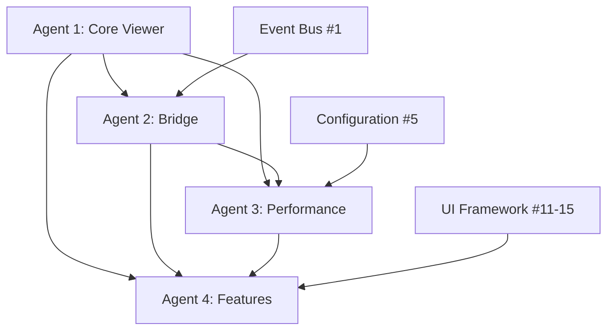

# PDF.js Integration Coordination Guide
**Issue #16 - Multi-Agent Development**

## 🎯 Mission Overview
Implement a complete PDF.js integration for TORE Matrix Labs V3 document viewer with high-performance rendering, element highlighting, advanced features, and seamless UI integration.

## 👥 Agent Assignments & Timeline

### Agent 1: Core Viewer Foundation (Days 1-2) 🟢
**Sub-Issue**: #124 | **Branch**: `feature/pdfjs-core-viewer`
- **Focus**: PDF.js bundle setup, QWebEngineView integration, basic controls
- **Deliverables**: PDFViewer class, PDF loading pipeline, zoom/pan/navigation
- **Critical Path**: ✅ Blocks all other agents
- **Dependencies**: None

### Agent 2: Qt-JavaScript Bridge (Days 2-3) 🟡  
**Sub-Issue**: #125 | **Branch**: `feature/pdfjs-bridge`
- **Focus**: QWebChannel communication, element highlighting, event forwarding
- **Deliverables**: PDFBridge class, bridge.js, element coordinate mapping
- **Dependencies**: Agent 1 PDFViewer foundation
- **Enables**: Agent 3 monitoring, Agent 4 features

### Agent 3: Performance Optimization (Days 3-4) 🔵
**Sub-Issue**: #126 | **Branch**: `feature/pdfjs-performance`  
- **Focus**: Memory management, large PDF optimization, hardware acceleration
- **Deliverables**: Performance monitoring, caching system, GPU acceleration
- **Dependencies**: Agent 1 viewer, Agent 2 bridge
- **Runs Parallel**: With Agent 4

### Agent 4: Advanced Features & Integration (Days 4-6) 🟣
**Sub-Issue**: #127 | **Branch**: `feature/pdfjs-features`
- **Focus**: Search, annotations, print, UI framework integration
- **Deliverables**: Feature implementations, UI integration, accessibility
- **Dependencies**: All other agents
- **Final Integration**: Complete user-facing system

## 🏗️ Technical Architecture



## 📦 Component Integration Points

### Core PDFViewer (Agent 1 → Others)
```python
class PDFViewer(QWebEngineView):
    # Interface for Agent 2 bridge attachment
    def attach_bridge(self, bridge: PDFBridge) -> None
    
    # Interface for Agent 3 performance monitoring  
    def set_performance_config(self, config: PerformanceConfig) -> None
    
    # Interface for Agent 4 feature integration
    def enable_features(self, features: FeatureSet) -> None
```

### Bridge Communication (Agent 2 → 3,4)
```python
class PDFBridge(QObject):
    # Signal for performance monitoring
    performance_event = pyqtSignal(str, dict)
    
    # Signal for feature events
    feature_event = pyqtSignal(str, dict)
    
    # Element highlighting for Agent 4
    def highlight_elements(self, elements: List[ElementCoordinate]) -> None
```

### Performance Monitoring (Agent 3 → 4)
```python
class PerformanceMonitor:
    # Metrics for UI display
    def get_current_metrics(self) -> PerformanceMetrics
    
    # Memory usage for UI warnings
    def get_memory_status(self) -> MemoryStatus
```

## 🔗 Integration Interfaces

### Agent 1 → Agent 2 Integration
```python
# PDFViewer provides bridge attachment point
viewer = PDFViewer()
bridge = PDFBridge(viewer)
viewer.attach_bridge(bridge)
```

### Agent 2 → Agent 3 Integration  
```python
# Bridge forwards performance events
bridge.performance_event.connect(performance_monitor.handle_event)
performance_monitor.configure_bridge(bridge)
```

### Agent 3 → Agent 4 Integration
```python
# Performance metrics drive UI feedback
performance_monitor.metrics_updated.connect(ui_manager.update_status)
```

### Agent 4 → UI Framework Integration
```python
# Complete integration with main UI
from torematrix.ui.layouts import LayoutManager
from torematrix.ui.components import ReactiveWidget

class PDFViewerWidget(ReactiveWidget):
    def __init__(self):
        self.pdf_viewer = PDFViewer()
        # ... UI integration
```

## 📋 Daily Coordination Checkpoints

### Day 1 End: Agent 1 Foundation Complete
- [ ] PDFViewer class functional
- [ ] PDF.js bundle integrated  
- [ ] Basic rendering operational
- [ ] **Ready for Agent 2 to begin**

### Day 2 End: Agent 2 Bridge Ready
- [ ] QWebChannel communication working
- [ ] Element highlighting functional
- [ ] Event forwarding operational
- [ ] **Ready for Agent 3 & 4 parallel work**

### Day 3 End: Agent 3 Performance Baseline
- [ ] Memory management implemented
- [ ] Performance monitoring active
- [ ] Large PDF support functional
- [ ] **Performance data available for Agent 4**

### Day 4 End: Core Features Complete
- [ ] Agent 3 optimization complete
- [ ] Agent 4 basic features implemented
- [ ] Search and text selection working
- [ ] **Ready for final integration**

### Day 5 End: Advanced Features Complete  
- [ ] Annotations and print functional
- [ ] UI framework integration complete
- [ ] Performance targets achieved
- [ ] **Ready for testing and polish**

### Day 6 End: Production Ready
- [ ] All features tested and integrated
- [ ] Cross-platform compatibility verified
- [ ] Documentation complete
- [ ] **Ready for deployment**

## 🎯 Success Metrics & Targets

### Performance Targets
- **Load Time**: <2s for typical PDFs (10-50MB)
- **Memory Usage**: <200MB for large documents
- **Navigation**: <50ms page transitions
- **Search**: <2s full document search
- **UI Response**: <100ms user interactions

### Quality Targets  
- **Test Coverage**: >95% across all components
- **Integration Tests**: All agent combinations tested
- **Cross-Platform**: Windows, macOS, Linux verified
- **Accessibility**: WCAG 2.1 compliance achieved

### User Experience Targets
- **Intuitive Controls**: Zoom, pan, navigate seamlessly
- **Search Experience**: Fast, accurate, well-highlighted
- **Visual Integration**: Matches application theme/style
- **Responsive UI**: Works across screen sizes/DPI

## 🔧 Development Workflow

### Branch Strategy
```
main
├── feature/pdfjs-core-viewer      (Agent 1)
├── feature/pdfjs-bridge           (Agent 2) 
├── feature/pdfjs-performance      (Agent 3)
└── feature/pdfjs-features         (Agent 4)
```

### Integration Sequence
1. **Day 2**: Agent 1 → Agent 2 (Foundation integration)
2. **Day 3**: Agent 2 → Agent 3 (Bridge performance)  
3. **Day 4**: Agent 3 → Agent 4 (Performance → Features)
4. **Day 5**: All agents → Integration branch
5. **Day 6**: Integration → Main (Production ready)

### Testing Strategy
- **Unit Tests**: Each agent >95% coverage
- **Integration Tests**: Agent pairs tested
- **End-to-End Tests**: Full workflow scenarios
- **Performance Tests**: Load, memory, responsiveness
- **User Acceptance**: Real-world document testing

## 🚨 Risk Mitigation

### Technical Risks
- **PDF.js Compatibility**: Test with multiple PDF versions
- **Memory Leaks**: Extensive memory testing and monitoring
- **Performance Degradation**: Continuous benchmarking
- **Cross-Platform Issues**: Test on all target platforms

### Integration Risks  
- **Agent Dependencies**: Clear interface contracts
- **Timeline Delays**: Parallel work where possible
- **Feature Conflicts**: Regular coordination meetings
- **Testing Gaps**: Comprehensive integration testing

## 📞 Communication Protocol

### Daily Standups (If Multiple Agents Active)
- **When**: End of each development day
- **What**: Progress, blockers, next day plans
- **Who**: All active agents

### Integration Points
- **Agent 1 → 2**: Day 2 handoff meeting
- **Agent 2 → 3,4**: Day 3 coordination meeting  
- **All Agents**: Day 5 integration review

### Issue Tracking
- **GitHub Issues**: Update progress on sub-issues daily
- **Branch Status**: Keep branches synced with main
- **Documentation**: Update coordination doc with decisions

---

**This coordination guide ensures systematic, efficient development of the PDF.js integration across 4 specialized agents, delivering a production-ready document viewer for TORE Matrix Labs V3.**