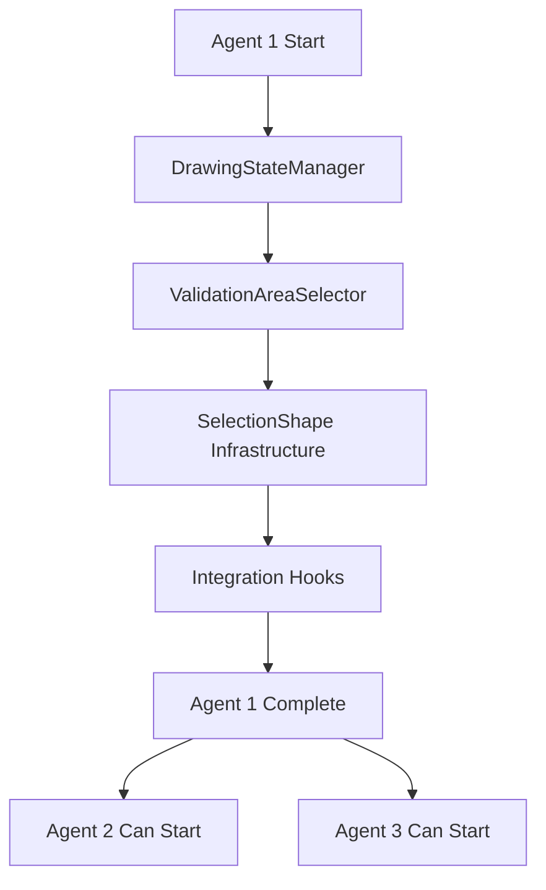
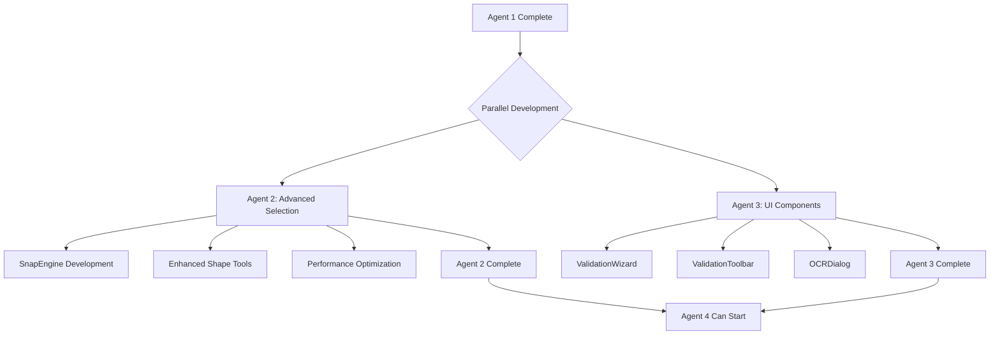
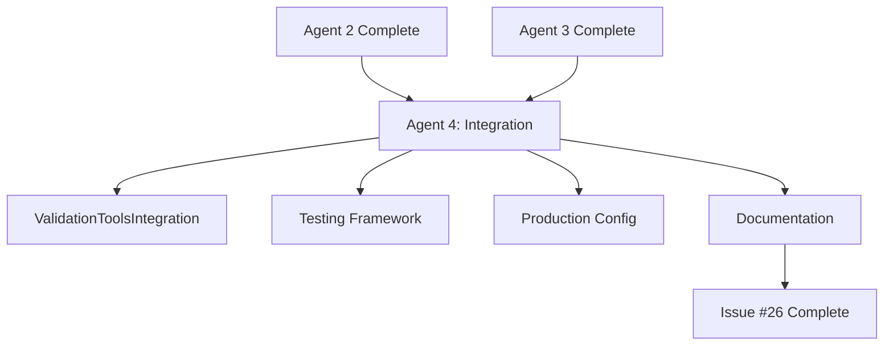

# Issue #26: Multi-Agent Coordination Guide for Manual Validation Area Selection Tools

## 🎯 **Multi-Agent Coordination Overview**

This guide provides comprehensive coordination instructions for implementing Issue #26 "[Manual Validation] Area Selection Tools" using a 4-agent parallel development approach. Each agent has specific responsibilities, dependencies, and integration points to ensure seamless collaboration.

---

## 🏗️ **Agent Responsibilities & Dependencies**

### **Agent 1: Core Validation Framework**
- **Primary Focus**: Foundation layer with state management and basic area selection
- **Dependencies**: None (Foundation agent)
- **Provides APIs for**: Agent 2 (selection enhancement), Agent 3 (UI integration), Agent 4 (system integration)
- **Key Deliverables**: DrawingStateManager, ValidationAreaSelector, SelectionShape infrastructure

### **Agent 2: Advanced Area Selection & Snapping**
- **Primary Focus**: Enhanced selection tools with snapping and performance optimization
- **Dependencies**: Agent 1 foundation APIs
- **Provides APIs for**: Agent 3 (UI feedback), Agent 4 (performance integration)
- **Key Deliverables**: SnapEngine, MagneticField detection, MultiAreaSelectionManager

### **Agent 3: UI Components & User Experience**
- **Primary Focus**: Professional UI components and user workflows
- **Dependencies**: Agent 1 state management + Agent 2 advanced selection
- **Provides APIs for**: Agent 4 (UI integration testing)
- **Key Deliverables**: ValidationWizard, ValidationToolbar, OCRDialog

### **Agent 4: Integration & Production Readiness**
- **Primary Focus**: System integration, testing, and production deployment
- **Dependencies**: Agent 1 foundation + Agent 2 selection + Agent 3 UI components
- **Provides**: Unified ValidationToolsIntegration interface
- **Key Deliverables**: Integration layer, comprehensive testing, production configuration

---

## 📋 **Development Workflow**

### **Phase 1: Agent 1 Foundation (Days 1-4)**


**Agent 1 Critical Deliverables:**
- [ ] DrawingStateManager with PyQt6 signals
- [ ] ValidationAreaSelector base implementation
- [ ] SelectionShape, RectangleShape, PolygonShape classes
- [ ] Event system and signal framework
- [ ] >95% test coverage
- [ ] API documentation

### **Phase 2: Parallel Development (Days 5-12)**


**Agent 2 & 3 Coordination Points:**
- Daily sync on shared API changes
- Integration testing every 2 days
- Performance benchmarking collaboration
- UI feedback integration points

### **Phase 3: Integration & Production (Days 13-16)**


---

## 🔄 **Daily Coordination Protocol**

### **Daily Sync Meeting Structure (15 minutes)**
1. **Agent Status Updates** (5 minutes)
   - Current progress against timeline
   - Blockers or dependencies
   - API changes or breaking changes

2. **Integration Points Discussion** (5 minutes)
   - Cross-agent API compatibility
   - Signal and event coordination
   - Performance benchmarking results

3. **Next 24 Hours Planning** (5 minutes)
   - Priority tasks and milestones
   - Cross-agent coordination needs
   - Testing and validation requirements

### **Communication Channels**
- **Primary**: GitHub issue comments on respective sub-issues
- **Real-time**: Agent coordination in development chat
- **Documentation**: Shared Google Doc for API changes and decisions
- **Code Reviews**: Cross-agent PR reviews within 4 hours

---

## 🔗 **API Integration Matrix**

### **Agent 1 → Agent 2 Integration**
```python
# Agent 1 provides foundation APIs
from .drawing_state import DrawingStateManager, DrawingMode
from .area_select import ValidationAreaSelector
from .shapes import SelectionShape, RectangleShape, PolygonShape

# Agent 2 extends with advanced features
class EnhancedValidationAreaSelector(ValidationAreaSelector):
    def __init__(self, state_manager: DrawingStateManager):
        super().__init__(state_manager)
        self.snap_engine = SnapEngine()  # Agent 2 addition
        self.boundary_detector = SmartBoundaryDetector()  # Agent 2 addition
```

### **Agent 1 + 2 → Agent 3 Integration**
```python
# Agent 3 uses both Agent 1 and 2 components
from .drawing_state import DrawingStateManager  # Agent 1
from .snapping import SnapEngine  # Agent 2

class ValidationWizard(QWizard):
    def __init__(self, state_manager: DrawingStateManager, snap_engine: SnapEngine):
        self.state_manager = state_manager  # Agent 1 integration
        self.snap_engine = snap_engine      # Agent 2 integration
```

### **Agent 1+2+3 → Agent 4 Integration**
```python
# Agent 4 coordinates all components
class ValidationToolsIntegration:
    def __init__(self):
        # Agent 1 components
        self.state_manager = DrawingStateManager()
        self.area_selector = ValidationAreaSelector()
        
        # Agent 2 components
        self.snap_engine = SnapEngine()
        self.boundary_detector = SmartBoundaryDetector()
        
        # Agent 3 components
        self.wizard = ValidationWizard()
        self.toolbar = ValidationToolbar()
```

---

## 🧪 **Integration Testing Strategy**

### **Continuous Integration Pipeline**
```yaml
# .github/workflows/validation-integration.yml
name: Validation Tools Integration

on:
  push:
    branches: 
      - feature/validation-*-agent*-issue26-*
  pull_request:
    branches:
      - main

jobs:
  agent1-tests:
    if: contains(github.ref, 'agent1')
    runs-on: ubuntu-latest
    steps:
      - name: Test Agent 1 Foundation
        run: |
          pytest tests/validation/agent1/ -v
          pytest tests/validation/integration/test_agent1_apis.py -v

  agent2-tests:
    if: contains(github.ref, 'agent2')
    needs: [agent1-tests]
    runs-on: ubuntu-latest
    steps:
      - name: Test Agent 2 + Agent 1 Integration
        run: |
          pytest tests/validation/agent2/ -v
          pytest tests/validation/integration/test_agent1_agent2.py -v

  agent3-tests:
    if: contains(github.ref, 'agent3')
    needs: [agent1-tests, agent2-tests]
    runs-on: ubuntu-latest
    steps:
      - name: Test Agent 3 + Agent 1+2 Integration
        run: |
          pytest tests/validation/agent3/ -v
          pytest tests/validation/integration/test_agent1_agent2_agent3.py -v

  agent4-tests:
    if: contains(github.ref, 'agent4')
    needs: [agent1-tests, agent2-tests, agent3-tests]
    runs-on: ubuntu-latest
    steps:
      - name: Test Complete Integration
        run: |
          pytest tests/validation/agent4/ -v
          pytest tests/validation/integration/test_full_integration.py -v
```

### **Integration Test Schedule**
- **Day 2**: Agent 1 foundation testing
- **Day 4**: Agent 1 complete integration testing
- **Day 8**: Agent 1+2 integration testing
- **Day 12**: Agent 1+2+3 integration testing
- **Day 16**: Complete system integration testing

---

## 📊 **Quality Gates & Milestones**

### **Agent 1 Quality Gate (Day 4)**
- [ ] All core APIs implemented and documented
- [ ] >95% unit test coverage
- [ ] Performance benchmarks established
- [ ] Integration hooks tested
- [ ] Signal framework operational

**Approval Required**: Agent 2 and Agent 3 confirm API compatibility

### **Agent 2 Quality Gate (Day 8)**
- [ ] Advanced selection tools implemented
- [ ] Snapping algorithms functional
- [ ] Performance optimization complete
- [ ] Agent 1 integration tested
- [ ] APIs ready for Agent 3 integration

**Approval Required**: Agent 3 confirms UI integration readiness

### **Agent 3 Quality Gate (Day 12)**
- [ ] All UI components implemented
- [ ] User workflow complete
- [ ] Agent 1+2 integration functional
- [ ] Accessibility compliance achieved
- [ ] UI performance optimized

**Approval Required**: Agent 4 confirms integration testing readiness

### **Agent 4 Quality Gate (Day 16)**
- [ ] Complete system integration functional
- [ ] All tests passing (>95% coverage)
- [ ] Production configuration complete
- [ ] Documentation generated
- [ ] Performance benchmarks met

**Approval Required**: Project stakeholders confirm production readiness

---

## 🚨 **Risk Management & Contingency Plans**

### **Dependency Risks**
| Risk | Impact | Mitigation | Contingency |
|------|--------|------------|-------------|
| Agent 1 API delays | High | Daily sync, early API freeze | Stub implementation for Agent 2+3 |
| Agent 2 performance issues | Medium | Continuous benchmarking | Fallback to basic selection tools |
| Agent 3 UI complexity | Medium | MVP approach, iterative development | Simplified UI version |
| Agent 4 integration complexity | High | Early integration testing | Phased integration approach |

### **Technical Risks**
| Risk | Impact | Mitigation | Contingency |
|------|--------|------------|-------------|
| PyQt6 compatibility issues | High | Version pinning, early testing | PyQt5 fallback |
| Performance degradation | Medium | Continuous monitoring | Performance optimization sprint |
| Memory leaks | Medium | Regular profiling | Memory usage limits |
| Signal coordination failures | High | Integration testing | Alternative communication methods |

### **Communication Risks**
| Risk | Impact | Mitigation | Contingency |
|------|--------|------------|-------------|
| Agent coordination breakdown | High | Daily syncs, clear protocols | Dedicated coordination agent |
| API misunderstanding | Medium | Documentation, examples | Code review requirements |
| Timeline conflicts | Medium | Buffer time, milestone tracking | Scope reduction |

---

## 📈 **Success Metrics & KPIs**

### **Development Velocity**
- **Agent 1**: Foundation complete by Day 4
- **Agent 2**: Advanced features complete by Day 8
- **Agent 3**: UI components complete by Day 12
- **Agent 4**: Integration complete by Day 16

### **Quality Metrics**
- **Test Coverage**: >95% across all agents
- **Performance**: All benchmarks met
- **Documentation**: 100% API coverage
- **Integration**: All cross-agent tests passing

### **Coordination Metrics**
- **Daily Sync Attendance**: 100%
- **API Change Communication**: <4 hours notification
- **Cross-Agent PR Review**: <4 hours response time
- **Integration Test Frequency**: Every 2 days minimum

---

## 🚀 **Deployment Coordination**

### **Agent Deployment Sequence**
1. **Agent 1 Deployment**: Day 1
   ```bash
   "I need you to work on Sub-Issue #26.1 - Core Validation Framework. Implement the foundational drawing state management, basic area selection, and shape infrastructure that Agent 2 and Agent 3 will build upon."
   ```

2. **Agent 2 Deployment**: Day 5 (after Agent 1 completion)
   ```bash
   "I need you to work on Sub-Issue #26.2 - Advanced Area Selection Tools. Build enhanced snapping systems, advanced shape tools, and performance optimization on top of Agent 1's core validation framework."
   ```

3. **Agent 3 Deployment**: Day 5 (parallel with Agent 2)
   ```bash
   "I need you to work on Sub-Issue #26.3 - UI Components & User Experience. Create professional validation wizard, toolbar, OCR dialog, and complete user experience workflows that integrate Agent 1's core framework."
   ```

4. **Agent 4 Deployment**: Day 13 (after Agent 2+3 completion)
   ```bash
   "I need you to work on Sub-Issue #26.4 - Integration & Production Readiness. Create the unified ValidationToolsIntegration interface, comprehensive testing framework, and production configuration system."
   ```

### **Branch Coordination Strategy**
```bash
# Agent branch naming convention
feature/validation-core-agent1-issue26-1
feature/validation-selection-agent2-issue26-2
feature/validation-ui-agent3-issue26-3
feature/validation-integration-agent4-issue26-4

# Integration branch
feature/validation-complete-issue26

# Merge strategy
1. Agent 1 → integration branch (Day 4)
2. Agent 2 → integration branch (Day 8)
3. Agent 3 → integration branch (Day 12)
4. Agent 4 → integration branch (Day 16)
5. Integration branch → main (Day 16)
```

---

## ✅ **Final Coordination Checklist**

### **Pre-Development**
- [ ] All agent instruction files created and reviewed
- [ ] GitHub sub-issues created (#26.1, #26.2, #26.3, #26.4)
- [ ] Branch strategy established
- [ ] Communication channels set up
- [ ] Integration testing framework prepared

### **During Development**
- [ ] Daily sync meetings conducted
- [ ] API changes communicated within 4 hours
- [ ] Cross-agent PR reviews completed within 4 hours
- [ ] Integration tests run every 2 days
- [ ] Performance benchmarks tracked continuously

### **Post-Development**
- [ ] All quality gates passed
- [ ] Complete integration testing successful
- [ ] Documentation generated and reviewed
- [ ] Production configuration validated
- [ ] Deployment readiness confirmed

---

**Multi-Agent Coordination Complete** 🎯

This coordination guide ensures seamless collaboration between all 4 agents implementing Issue #26, with clear dependencies, communication protocols, integration points, and success criteria for delivering a production-ready manual validation area selection system.