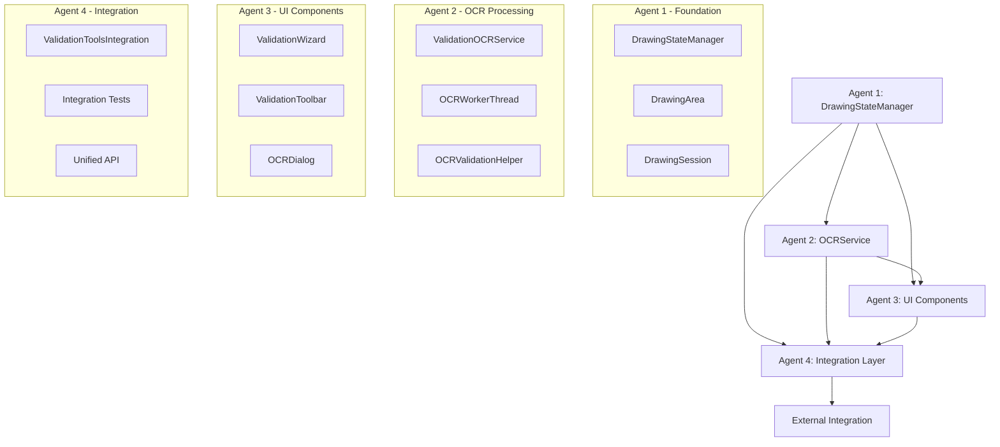

# VALIDATION COORDINATION GUIDE

## 🎯 Multi-Agent Coordination for Issue #27: Manual Validation Element Drawing Interface

### 📊 **Agent Overview**
- **Agent 1**: Core Drawing State Management (#238) - Foundation
- **Agent 2**: OCR Service Integration (#240) - Data Processing  
- **Agent 3**: UI Components & User Experience (#242) - Interface
- **Agent 4**: Integration Layer & Testing (#244) - Unification

### 🔄 **Development Timeline**

#### **Phase 1: Foundation (Days 1-2)**
- **Agent 1**: Core Drawing State Management
  - **Priority**: Highest (no dependencies)
  - **Deliverables**: DrawingStateManager, DrawingArea, DrawingSession
  - **Integration Points**: Provides state management for all other agents
  - **Success Criteria**: All state transitions working, area validation functional

#### **Phase 2: Parallel Development (Days 3-4)**
- **Agent 2**: OCR Service Integration
  - **Priority**: High (depends on Agent 1)
  - **Deliverables**: ValidationOCRService, worker threads, quality assessment
  - **Integration Points**: Connects to Agent 1 drawing manager, provides OCR for Agent 3
  - **Success Criteria**: Multi-threaded OCR processing, quality assessment working

- **Agent 3**: UI Components & User Experience
  - **Priority**: High (depends on Agent 1 & 2)
  - **Deliverables**: ValidationWizard, ValidationToolbar, OCRDialog
  - **Integration Points**: Uses Agent 1 state, consumes Agent 2 OCR results
  - **Success Criteria**: Complete UI workflow, professional styling

#### **Phase 3: Integration & Testing (Days 5-6)**
- **Agent 4**: Integration Layer & Testing
  - **Priority**: Critical (depends on all agents)
  - **Deliverables**: ValidationToolsIntegration, comprehensive tests
  - **Integration Points**: Unifies all agent components, provides external API
  - **Success Criteria**: Seamless integration, >95% test coverage

### 🔗 **Integration Architecture**



### 📋 **Inter-Agent Dependencies**

#### **Agent 1 → Agent 2**
```python
# Agent 1 provides OCR integration hooks
def initialize_ocr(self, config: Optional[Dict[str, Any]] = None) -> None:
    """Initialize OCR engine with configuration."""

def set_callbacks(self, element_creator: Optional[Callable] = None) -> None:
    """Set callback functions for element creation."""

# Agent 2 uses these hooks
drawing_manager.initialize_ocr(self.get_config().__dict__)
drawing_manager.set_callbacks(element_creator=self._create_element)
```

#### **Agent 1 → Agent 3**
```python
# Agent 1 provides state management signals
mode_changed = pyqtSignal(DrawingMode)
state_changed = pyqtSignal(DrawingState)
area_selected = pyqtSignal(DrawingArea)

# Agent 3 connects to these signals
drawing_manager.mode_changed.connect(self._on_drawing_mode_changed)
drawing_manager.state_changed.connect(self._on_drawing_state_changed)
drawing_manager.area_selected.connect(self._on_area_selected)
```

#### **Agent 2 → Agent 3**
```python
# Agent 2 provides OCR result signals
ocr_completed = pyqtSignal(ValidationOCRResponse)
ocr_failed = pyqtSignal(str, str)

# Agent 3 uses OCR results in UI
ocr_service.ocr_completed.connect(self._on_ocr_completed)
ocr_service.ocr_failed.connect(self._on_ocr_failed)
```

#### **All Agents → Agent 4**
```python
# Agent 4 integrates all components
class ValidationToolsIntegration:
    def __init__(self):
        self.drawing_manager = DrawingStateManager()  # Agent 1
        self.ocr_service = ValidationOCRService()     # Agent 2
        self.toolbar = None                           # Agent 3
        
    def create_toolbar(self) -> ValidationToolbar:   # Agent 3
        self.toolbar = ValidationToolbar()
        self.toolbar.set_drawing_manager(self.drawing_manager)
        self.toolbar.set_ocr_service(self.ocr_service)
        return self.toolbar
```

### 🧪 **Testing Coordination**

#### **Agent 1 Testing**
- **Focus**: State management, area validation, session handling
- **Coverage**: >95% for drawing state logic
- **Dependencies**: None (isolated testing)

#### **Agent 2 Testing**
- **Focus**: OCR processing, worker threads, quality assessment
- **Coverage**: >95% for OCR service logic
- **Dependencies**: Agent 1 drawing manager (mocked)

#### **Agent 3 Testing**
- **Focus**: UI components, user interactions, visual feedback
- **Coverage**: >95% for UI logic
- **Dependencies**: Agent 1 & 2 components (mocked)

#### **Agent 4 Testing**
- **Focus**: Integration testing, full workflow validation
- **Coverage**: >95% for integration logic + comprehensive integration tests
- **Dependencies**: All agent components (real integration)

### 📊 **Quality Assurance Standards**

#### **Code Quality**
- **Type Coverage**: 100% type hints
- **Documentation**: Complete API documentation
- **Code Style**: Consistent formatting and naming
- **Error Handling**: Comprehensive error recovery

#### **Testing Standards**
- **Unit Testing**: >95% coverage per agent
- **Integration Testing**: Complete workflow testing
- **Performance Testing**: OCR processing benchmarks
- **UI Testing**: User interaction validation

#### **Integration Standards**
- **API Consistency**: Clean, uniform interfaces
- **Signal Handling**: Proper Qt signal/slot usage
- **Error Propagation**: Graceful error handling
- **Performance**: Responsive UI, efficient processing

### 🚀 **Deployment Sequence**

#### **Sequential Deployment (Recommended)**
```bash
# 1. Deploy Agent 1 (Foundation)
"I need you to work on Issue #238 as Agent 1 - Core Drawing State Management"

# 2. Wait for Agent 1 completion, then deploy Agent 2
"I need you to work on Issue #240 as Agent 2 - OCR Service Integration"

# 3. Wait for Agent 2 completion, then deploy Agent 3
"I need you to work on Issue #242 as Agent 3 - UI Components & User Experience"

# 4. Wait for Agent 3 completion, then deploy Agent 4
"I need you to work on Issue #244 as Agent 4 - Integration Layer & Testing"
```

#### **Parallel Deployment (Advanced)**
```bash
# 1. Deploy Agent 1 first (required foundation)
"I need you to work on Issue #238 as Agent 1 - Core Drawing State Management"

# 2. After Agent 1 complete, deploy Agent 2 & 3 in parallel
"I need you to work on Issue #240 as Agent 2 - OCR Service Integration"
"I need you to work on Issue #242 as Agent 3 - UI Components & User Experience"

# 3. After Agent 2 & 3 complete, deploy Agent 4
"I need you to work on Issue #244 as Agent 4 - Integration Layer & Testing"
```

### 🔍 **Progress Monitoring**

#### **Completion Tracking**
- [ ] Agent 1: Core Drawing State Management (#238) - Foundation Ready
- [ ] Agent 2: OCR Service Integration (#240) - Data Processing Ready
- [ ] Agent 3: UI Components & User Experience (#242) - Interface Ready
- [ ] Agent 4: Integration Layer & Testing (#244) - Full Integration Ready

#### **Integration Checkpoints**
1. **Checkpoint 1**: Agent 1 complete → Agent 2 can start
2. **Checkpoint 2**: Agent 1 complete → Agent 3 can start  
3. **Checkpoint 3**: Agent 2 complete → Agent 3 has full OCR integration
4. **Checkpoint 4**: All agents complete → Agent 4 final integration

### 📋 **Communication Protocol**

#### **Agent Status Updates**
- **Daily Progress**: Each agent reports progress on their sub-issue
- **Integration Points**: Document API changes that affect other agents
- **Blockers**: Immediately report any blockers or dependency issues
- **Completion**: Full completion summary with integration notes

#### **Issue Management**
- **Sub-Issue Updates**: Update GitHub issues with progress
- **Main Issue Tracking**: Agent 4 manages main issue #27 status
- **PR Coordination**: Each agent creates PR for their sub-issue
- **Final Integration**: Agent 4 creates final integration PR

### 🎯 **Success Metrics**

#### **Technical Metrics**
- **Test Coverage**: >95% across all agents
- **Performance**: OCR processing <2s, UI responsiveness <100ms
- **Integration**: All components work seamlessly together
- **Error Handling**: Graceful failure recovery

#### **User Experience Metrics**
- **Workflow Completion**: Users can complete full validation workflow
- **Error Feedback**: Clear error messages and recovery options
- **Professional UI**: Polished, responsive interface
- **Accessibility**: Keyboard shortcuts and screen reader support

### 🔧 **Risk Management**

#### **Potential Risks**
1. **Agent 1 Delays**: Blocks all other agents → Prioritize Agent 1
2. **OCR Integration Issues**: Agent 2 threading problems → Thorough testing
3. **UI Complexity**: Agent 3 UI components too complex → Simplify design
4. **Integration Failures**: Agent 4 integration issues → Early testing

#### **Mitigation Strategies**
1. **Early Testing**: Test integration points as soon as possible
2. **Fallback Plans**: Have simple fallback implementations ready
3. **Communication**: Daily standup to identify issues early
4. **Documentation**: Clear API documentation to prevent integration issues

### 📚 **Documentation Requirements**

#### **Agent Documentation**
- **API Documentation**: Complete method and class documentation
- **Integration Examples**: Code examples for other agents
- **Testing Guide**: How to test each component
- **Troubleshooting**: Common issues and solutions

#### **Final Documentation**
- **User Guide**: Complete validation workflow guide
- **Developer Guide**: How to extend and customize
- **Integration Guide**: How to integrate with other systems
- **Performance Guide**: Optimization and tuning tips

---

## 🎯 **COORDINATION SUCCESS CRITERIA**

### **Individual Agent Success**
- Each agent completes their sub-issue with >95% test coverage
- All APIs are clean and well-documented
- Integration points are clearly defined and tested
- Each agent follows the standard "end work" routine

### **Overall Project Success**
- All 4 agents work together seamlessly
- Complete validation workflow functions correctly
- Professional UI with excellent user experience
- Comprehensive testing and documentation
- Main issue #27 closed with full completion summary

This coordination guide ensures efficient parallel development while maintaining high quality and seamless integration across all agents.