# 🔄 TORE Matrix Labs V2 - Complete Architecture Flowchart

## 📊 **System Overview Diagram**

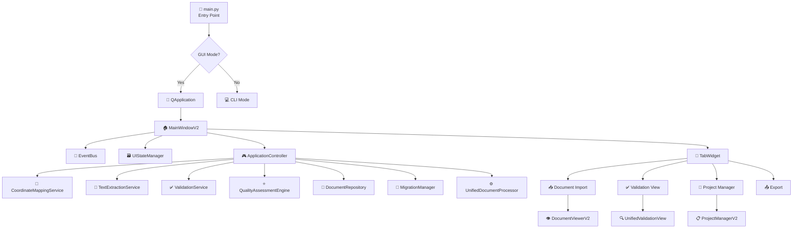

---

## 🎯 **Document Processing Pipeline Flow**

```mermaid
flowchart TD
    %% Document Input
    START([🎬 User Action]) --> LOAD_DOC{Load Document?}
    
    %% Document Loading Branch
    LOAD_DOC -->|File Select| FILE_DIALOG[📂 File Dialog]
    LOAD_DOC -->|.tore File| TORE_LOAD[📋 .tore File Load]
    
    FILE_DIALOG --> VALIDATE_FORMAT{Valid Format?}
    VALIDATE_FORMAT -->|PDF/DOCX/ODT/RTF| CREATE_DOC[📄 Create UnifiedDocument]
    VALIDATE_FORMAT -->|Invalid| ERROR_FORMAT[❌ Format Error]
    
    TORE_LOAD --> MIGRATION_CHECK{Migration Needed?}
    MIGRATION_CHECK -->|V1→V2| MIGRATE[🔄 Migrate Data]
    MIGRATION_CHECK -->|V2| LOAD_EXISTING[📋 Load Existing]
    
    %% Document Creation
    CREATE_DOC --> SET_METADATA[📊 Set Metadata]
    SET_METADATA --> DOC_LOADED[✅ Document Loaded]
    MIGRATE --> DOC_LOADED
    LOAD_EXISTING --> DOC_LOADED
    
    %% Processing Pipeline
    DOC_LOADED --> PROCESS_REQ{Process Request?}
    PROCESS_REQ -->|Yes| EXTRACT_CONTENT[📄 Extract Content]
    PROCESS_REQ -->|No| DISPLAY_DOC[👁️ Display Document]
    
    %% Text Extraction
    EXTRACT_CONTENT --> STRATEGY_SELECT{Extraction Strategy}
    STRATEGY_SELECT -->|PyMuPDF| PYMUPDF[📄 PyMuPDF Extraction]
    STRATEGY_SELECT -->|OCR| OCR_EXTRACT[👁️ OCR Extraction]
    STRATEGY_SELECT -->|Unstructured| UNSTR_EXTRACT[🏗️ Unstructured Extraction]
    
    PYMUPDF --> COORD_MAP[📍 Coordinate Mapping]
    OCR_EXTRACT --> COORD_MAP
    UNSTR_EXTRACT --> COORD_MAP
    
    COORD_MAP --> CONTENT_ANALYSIS[🔍 Content Analysis]
    CONTENT_ANALYSIS --> TABLES[📊 Table Detection]
    CONTENT_ANALYSIS --> IMAGES[🖼️ Image Detection]
    CONTENT_ANALYSIS --> DIAGRAMS[📈 Diagram Detection]
    
    %% Quality Assessment
    TABLES --> QUALITY_ASSESS[⭐ Quality Assessment]
    IMAGES --> QUALITY_ASSESS
    DIAGRAMS --> QUALITY_ASSESS
    
    QUALITY_ASSESS --> QUALITY_SCORE[📊 Quality Score]
    QUALITY_SCORE --> VALIDATION_NEEDED{Validation Needed?}
    
    %% Validation Branch
    VALIDATION_NEEDED -->|Yes| MANUAL_VALIDATION[👤 Manual Validation]
    VALIDATION_NEEDED -->|No| PROCESSING_COMPLETE[✅ Processing Complete]
    
    MANUAL_VALIDATION --> PAGE_VALIDATION[📄 Page-by-Page Validation]
    PAGE_VALIDATION --> ISSUE_DETECTION[🔍 Issue Detection]
    ISSUE_DETECTION --> COORDINATE_HIGHLIGHT[📍 Coordinate Highlighting]
    COORDINATE_HIGHLIGHT --> USER_REVIEW[👤 User Review]
    USER_REVIEW --> APPROVE_REJECT{Approve/Reject?}
    APPROVE_REJECT -->|Approve| VALIDATION_COMPLETE[✅ Validation Complete]
    APPROVE_REJECT -->|Reject| ISSUE_CORRECTION[🔧 Issue Correction]
    ISSUE_CORRECTION --> USER_REVIEW
    
    %% Final Processing
    VALIDATION_COMPLETE --> PROCESSING_COMPLETE
    PROCESSING_COMPLETE --> SAVE_DOC[💾 Save Document]
    SAVE_DOC --> UPDATE_PROJECT[📁 Update Project]
    UPDATE_PROJECT --> EXPORT_READY[📤 Export Ready]
```

---

## 📡 **Event Bus Communication Flow**

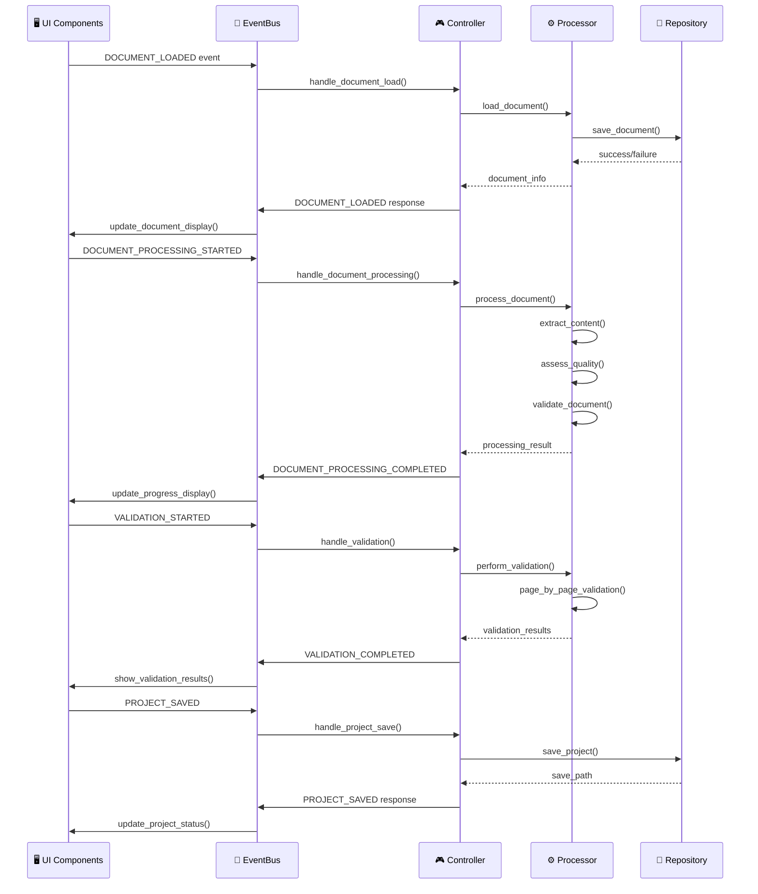

---

## 🏗️ **Service Architecture & Dependencies**

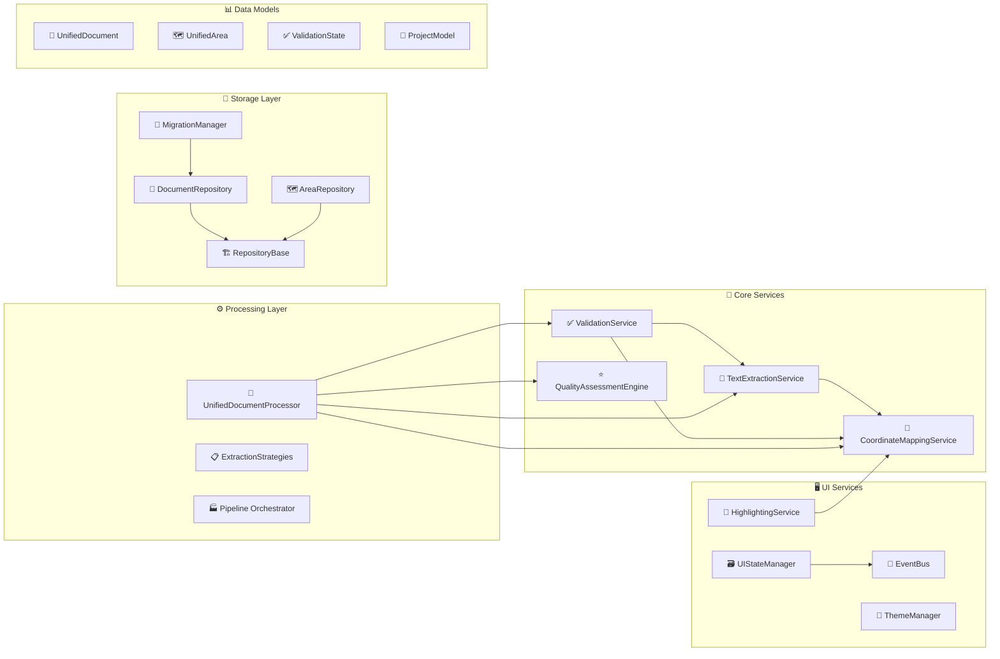

---

## 🔄 **Complete Function Call Flow**

```mermaid
flowchart TD
    %% Main Application Start
    START([🎬 Application Start]) --> MAIN_INIT[🚀 main.py initialization]
    MAIN_INIT --> CREATE_APP[📱 Create QApplication]
    CREATE_APP --> INIT_SERVICES[🔧 Initialize Services]
    
    %% Service Initialization
    INIT_SERVICES --> EVENT_BUS_INIT[📡 EventBus.__init__()]
    INIT_SERVICES --> STATE_INIT[🗃️ UIStateManager.__init__()]
    INIT_SERVICES --> CONTROLLER_INIT[🎮 ApplicationController.__init__()]
    
    %% Controller Service Setup
    CONTROLLER_INIT --> COORD_INIT[📍 CoordinateMappingService.__init__()]
    CONTROLLER_INIT --> EXTRACT_INIT[📄 TextExtractionService.__init__()]
    CONTROLLER_INIT --> VALID_INIT[✅ ValidationService.__init__()]
    CONTROLLER_INIT --> QUALITY_INIT[⭐ QualityAssessmentEngine.__init__()]
    CONTROLLER_INIT --> REPO_INIT[💾 DocumentRepository.__init__()]
    CONTROLLER_INIT --> MIGRATION_INIT[🔄 MigrationManager.__init__()]
    CONTROLLER_INIT --> PROCESSOR_INIT[⚙️ UnifiedDocumentProcessor.__init__()]
    
    %% UI Creation
    INIT_SERVICES --> MAIN_WINDOW_INIT[🏠 MainWindowV2.__init__()]
    MAIN_WINDOW_INIT --> CREATE_MENU[📋 _create_menu_bar()]
    MAIN_WINDOW_INIT --> CREATE_TOOLBAR[🔧 _create_tool_bar()]
    MAIN_WINDOW_INIT --> CREATE_TABS[📑 _create_tabs()]
    MAIN_WINDOW_INIT --> CREATE_DOCKS[🏠 _create_dock_widgets()]
    
    %% Tab Creation
    CREATE_TABS --> IMPORT_TAB_INIT[📥 _create_import_tab()]
    CREATE_TABS --> VALID_TAB_INIT[✅ UnifiedValidationView.__init__()]
    CREATE_TABS --> PROJECT_TAB_INIT[📁 ProjectManagerV2.__init__()]
    CREATE_TABS --> EXPORT_TAB_INIT[📤 _create_export_tab()]
    
    %% Import Tab Components
    IMPORT_TAB_INIT --> DOC_VIEWER_INIT[👁️ DocumentViewerV2.__init__()]
    IMPORT_TAB_INIT --> DOC_LIST_INIT[📋 _create_document_list()]
    
    %% Event Setup
    MAIN_WINDOW_INIT --> SETUP_EVENTS[📡 _setup_events()]
    SETUP_EVENTS --> EVENT_SUBSCRIPTIONS[📬 event_bus.subscribe()]
    
    %% Controller Event Binding
    INIT_SERVICES --> SETUP_CONTROLLER_EVENTS[🔗 _setup_controller_events()]
    SETUP_CONTROLLER_EVENTS --> BIND_DOC_LOAD[📄 handle_document_load]
    SETUP_CONTROLLER_EVENTS --> BIND_DOC_PROCESS[⚙️ handle_document_processing]
    SETUP_CONTROLLER_EVENTS --> BIND_PROJECT_OPS[📁 handle_project_operations]
    
    %% Application Ready
    EVENT_SUBSCRIPTIONS --> APP_SHOW[📺 main_window.show()]
    APP_SHOW --> APP_EXEC[🔄 app.exec_()]
```

---

## 📄 **Document Processing Function Calls**

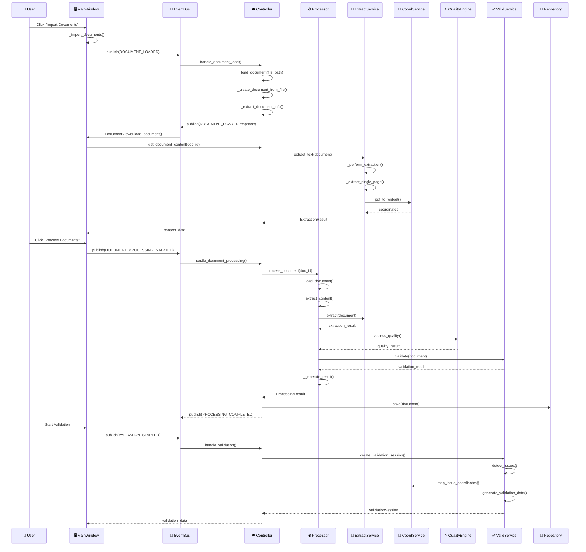

---

## 🗂️ **Data Flow & State Management**

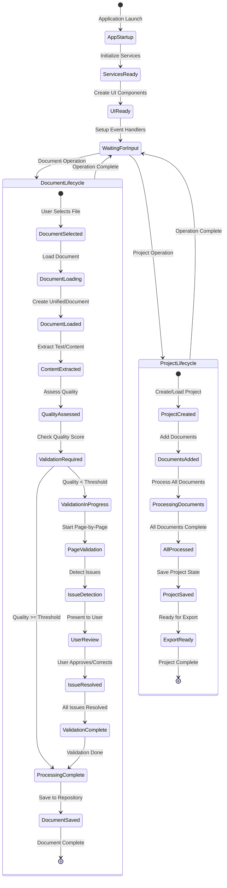

---

## 🎛️ **Event Types & Signal Flow**

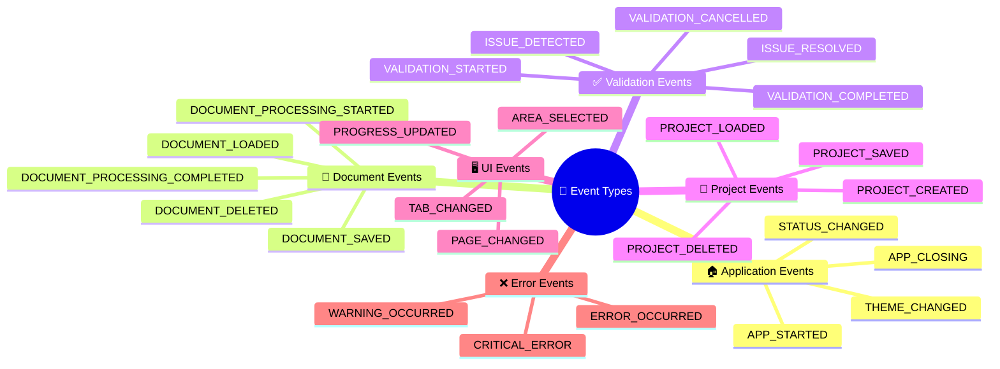

---

## 🔧 **Service Methods & Functions**

### **ApplicationController Methods:**
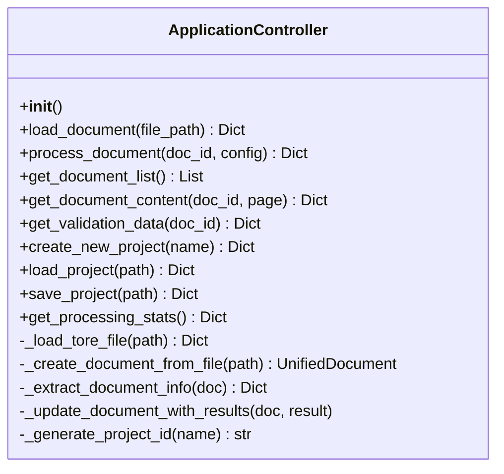

### **TextExtractionService Methods:**
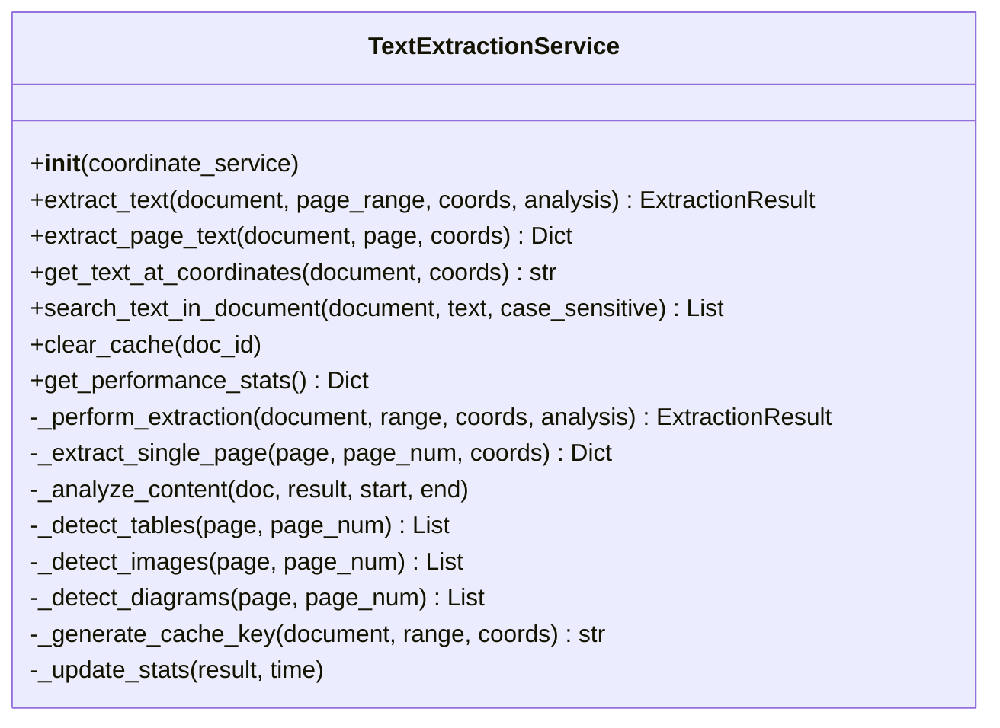

### **ValidationService Methods:**
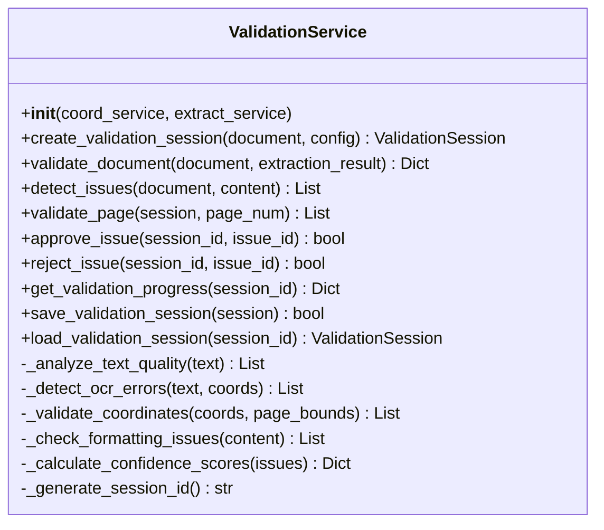

---

## 📊 **Complete System Data Flow**

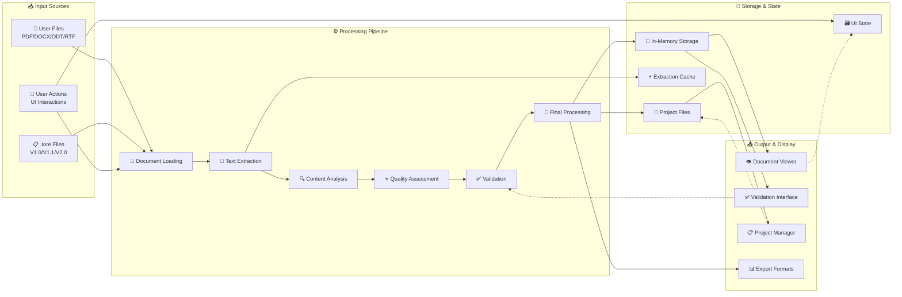

---

## 🎯 **Study Guide: Key Areas for Improvement**

### **🔍 Performance Optimization Areas:**
1. **Text Extraction Caching** - Improve cache hit rates
2. **Coordinate Mapping** - Optimize coordinate calculations
3. **Memory Management** - Better document lifecycle management
4. **Batch Processing** - Parallel document processing

### **🔧 Functionality Enhancements:**
1. **Advanced OCR** - Better OCR error detection
2. **Machine Learning** - AI-powered quality assessment
3. **Real-time Validation** - Live validation feedback
4. **Cloud Integration** - Remote processing capabilities

### **🖥️ UI/UX Improvements:**
1. **Progressive Loading** - Better user feedback during processing
2. **Advanced Filtering** - Better document organization
3. **Keyboard Shortcuts** - Power user features
4. **Accessibility** - Screen reader support

### **🔄 Architecture Enhancements:**
1. **Plugin System** - Extensible extraction strategies
2. **Microservices** - Distributed processing
3. **Event Sourcing** - Better audit trails
4. **CQRS Pattern** - Separate read/write models

---

*This flowchart provides a complete visual representation of the TORE Matrix Labs V2 system for study and improvement planning.*